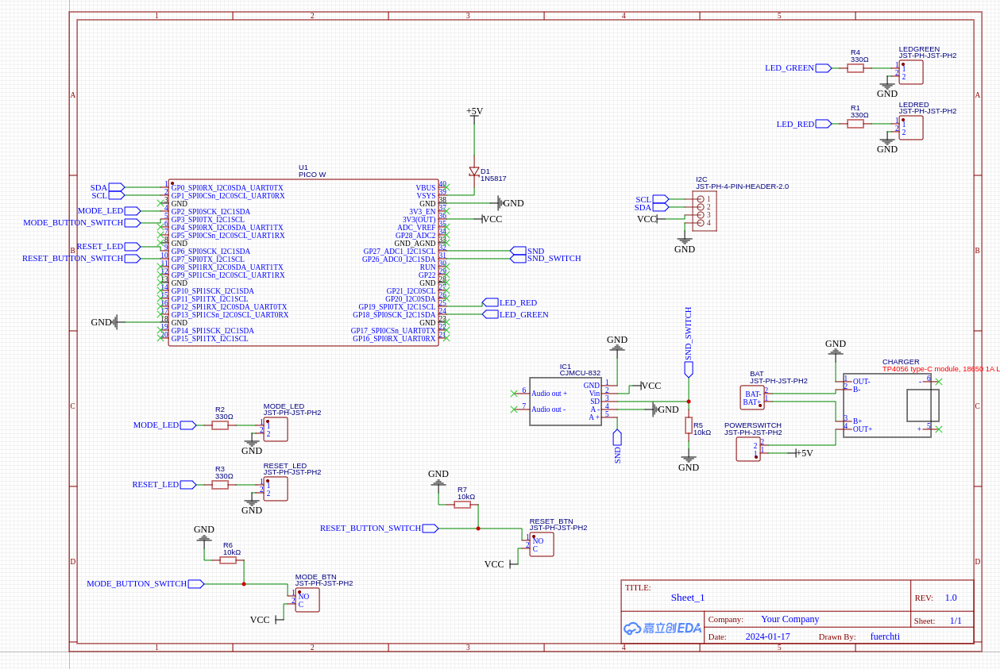
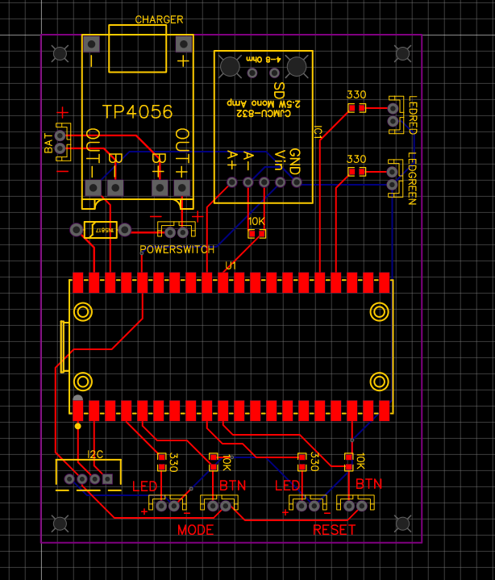

# Simon plays songs project

This project was about creating a toy for my daughter, but mainly to use my 3D printer and to play with electronics.
I keep this here mostly for my own reference in case I have to do build another one at some point.

It basically plays a song one note at the time while lighting up the neotrellis pad, starting with only one note. Every time
the player repeats the same sequence correctly the computer plays the one more note from the song (starting again from the first)

A quick warning, I really don't know much about designing PCBs, 3D designs or embedded coding, so in the unlikely case anyone
is actually reading this please do share anything that helps me get better at this.


## Required parts

- Adafruit NeoTrellis RGB Driver PCB for 4x4 Keypad (https://www.adafruit.com/product/3954)
- Silicone Elastomer 4x4 Button Keypad - for 3mm LEDs (https://www.adafruit.com/product/1611)
- Class D amplifier, I used a cheap version of this from ebay (https://learn.adafruit.com/adafruit-pam8302-mono-2-5w-class-d-audio-amplifier, https://www.ebay.co.uk/itm/296038863752)
- A Raspberry Pi Pico (or a pico w would also work) (https://www.raspberrypi.com/products/raspberry-pi-pico/)
- A TP4056 type-C module, 18650 1A Lipo Battery Charging Board (https://www.ebay.co.uk/itm/196094318206)
- A 18650 Lipo battery, any really (https://www.ebay.co.uk/itm/225954166690?var=525048445470)
- A holder for the battery (https://www.ebay.co.uk/itm/295940408206?var=594127652418)
- Two arcade buttons (https://www.ebay.co.uk/itm/314105692727)
- Two mountable LEDs, one red one green (https://www.ebay.co.uk/itm/125364743419?var=426382146596)
- One switch button for the power switch (https://www.ebay.co.uk/itm/304538493663)
- Some JST PH 2 connectors & sockets (you will need a crimping tool if you want those connectors on the buttons / LEDs)
- A couple of 330 & 10k resistors (SMD if you make the PCB)
- One shottky Diode (https://uk.farnell.com/stmicroelectronics/1n5817/diode-schottky-1a-20v-do-41/dp/9801197)
- M2 insets & screws (https://www.amazon.co.uk/gp/product/B0B8GN63S2)
- A 4 ohm speaker (42mm screw holes distance if you don't want to modify the box) (https://www.amazon.co.uk/gp/product/B07DTFX76C)


## Schematics

I had a PCB made as there is already a lot of cables in the box and it is pretty cheap with https://jlcpcb.com - if you
go down that route I included the gerber [file](schematics/Gerber_PCB.zip), if not you will have to modify the 3d printed box to
include the mounts you need for the individual parts.

The pico is surface mounted, so are the resistors, so you want a reflow oven for that most likely.






## Connecting stuff

- Mode, there are two JST PH 2 connectors one for the button's led and one for the button. It is used to switch between song selection and playing modes
- Reset, again two JST PH 2 connectors one for the button's led and one for the button. It is not used to reset anything, but to toggle the sound on / off.
- POWERSWITCH, connect to the middle switch button. Cuts the power to the PCB
- BAT, obviously the battery holder that holds the 18650 Lipo battery
- LEDGREEN, connect to the green LED, which indicates it is the users turn to press the buttons
- LEDRED, connect to the red LED, indicating it is the computers turn
- I2C, connect to the NeoTrellis RGB Driver board

## 3D printing the box

There is a [FreeCAD](printedParts/simon-says-box.FCStd) file if you want to modify it for different parts or if you don't want to have the PCB made.
There is also the STL files in the ./printedParts folder in case no modification is needed. It is pretty obvious where the m2 insets should get added.

## Building the U2F

Make sure you have the pico C sdk setup (https://github.com/raspberrypi/pico-sdk) and the environment variables exported.
This was written against version `1.5.1` so this might need some rework if the current version is far higher than this.

### Clone the repo & dependencies
```shell
git clone git@github.com:a-mueller/simonsays.git
cd simonsays
git submodule init
git submodule update
```

### Build
```shell
mkdir build
cd build
cmake ..
```

use the resulting u2f file and copy it over to the board


